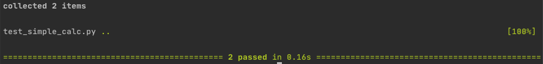

# TDD Task

### Tasks
1. Create a test to check if the number has remainder 0.
2. Create a class and method to write code to pass the test.
3. create  a test to check if given values are positive.
4. Create a method in the class to pass the test.

### Acceptance Criteria:
* Create a new repo
* Create a new project 
* Create a file to write tests 
* Create a file to write code
* Implement pseudo coding
* Create a README documenting the steps to successfully achieve the task.


# Steps
1. Create a new project in PyCharm and a new repository on GitHub.
2. Within the project, create a [.gitignore](.gitignore) file to ignore irrelevant files.
3. Create a test file and code file.
4. Install the pytest module
    ```python
    pip install pytest
    ```
5. Within the test file, import relevant libraries:
    ```python
    from simple_calc import Checker
    import unittest
    import pytest
    ```
6. Create a testing class which is a child of ```unittest.TestCase```
    ```python
    class TestChecker(unittest.TestCase):
    ```
7. Within the test class, instantiate the class which will be tested i.e the code class.
    ```python
    checker=Checker()
    ```
8. Define test functions, making sure to adhere to naming convention by starting with ```test_<name>```   
    * Modulus - The modulus function uses ```assertEqual``` to test whether the the result of 9%3==0.   
    * Positive - The positive function uses the ```assertGreater``` method to check whether the integer provided is greater than 0.
    ```python
        # The modulus test checks if the number 1 is divisible by 2. If so the remainder should be 0
        def test_mod(self):
            self.assertEqual(self.checker.mod(9,3),0)
    
        # The positive test checks if a number is greater than 0.
        def test_positive(self):
            self.assertGreater(self.checker.positive(9),0)
    ```
9. Go to the code file and create a class, making sure to stick to the name used during instantiation i.e step 6.
    ```python
    class Checker:
    ```
10. Create the functions within the class. 
    * The modulus function takes two numbers and returns the modulus.
    * The positive function returns True if a number is greater than 0. 
     ```python
    
        def mod(self,num1,num2):
            return num1%num2
    
        def positive(self, num1, num2):
            return True
    ```
11. Run the tests. Use the following command in the terminal:
    ```
    python -m pytest
    ```
    
The output of the tests should be as follows:
